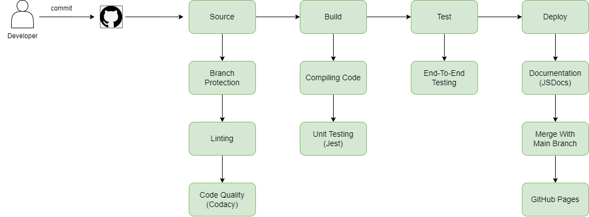

# Phase 1 CI/CD Pipeline

## Task description
A short 2 page (roughly) status on the pipeline in terms of what is currently functional (and what is planned or in progress). Embed your diagram in the markdown file.

## Status of the Pipeline
### Overall Status
The pipeline is currently completed, however, modifications may be necessary as the project progresses.

### What is Functional
- **Linting (Template Used)**
  - Description: Ensures that the code follows the defined style and conventions. Utilizes a template for consistency.
- **Code Quality (Codacy)**
  - Description: Automatically analyzes the code to identify issues that might affect quality and maintainability.
- **Code Quality Human Review (Pull Request)**
  - Description: Code changes are reviewed by members to ensure quality before merging.
- **Unit Testing (Jest)**
  - Description: Tests individual units of code to ensure they function as expected.
- **Automated Documentation (JSDocs)**
  - Description: Generates documentation automatically from the codebase, ensuring it stays up-to-date.
- **End-to-End and Pixel Testing (Jest, Puppeteer)**
  - Description: Validates the complete flow of the application and the visual integrity of UI components.

### What is Planned / In Progress
- **Detailed Unit Tests (Phase 2)**
  - Description: Extension of current unit tests to cover additional scenarios and edge cases.
- **Pipeline Documentation (Phase 2)**
  - Description: Development of comprehensive documentation detailing all stages of the software development pipeline, tools used, and processes.

## Diagram embed

