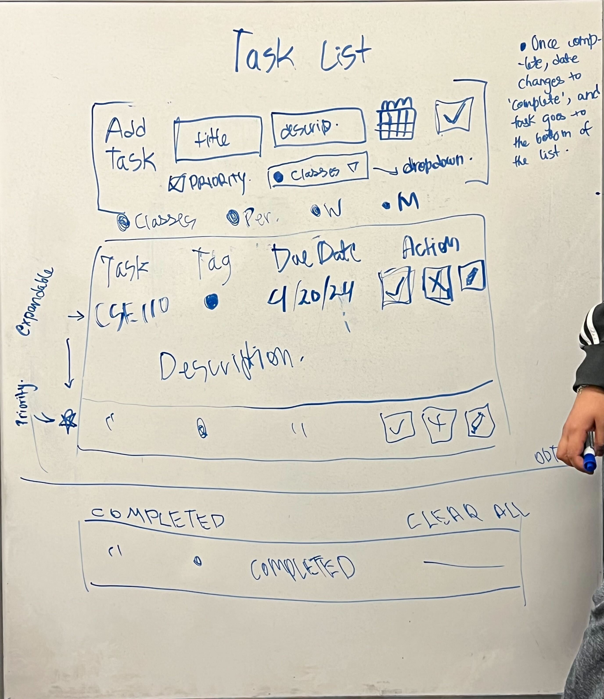
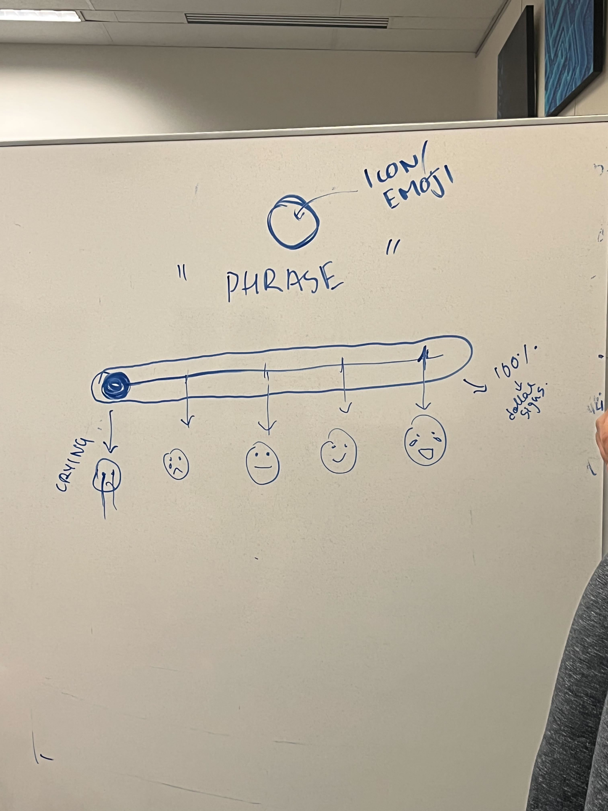

# Warm-up Assignment Meeting
**Date:** April 22, 2024

**Time:** 3-5pm

**Location:** Geisel

## Attendance
- Minsang (Min) Kim
- Ryan Seidl
- Ishika Agrawal
- Aritra Dutta
- Sarena
- Bernico Jansen Chandra
- Taiki Yoshino
- Rick Rodness
- Michael Cheung
- Elijah

*Missing: Sam*

## Agenda
+ Decide which widget to work on
+ Designing and Planning
+ Tests, Documentation, SWOT Analysis, and YouTube Video
+ Action Items, Delegation, and Deadlines

## Meeting Minutes
### Decide which widget to work on
+ Task List (submitting this for sure)
   - Michael
   - Min
   - Taiki
+ Sentiment Widget (submitting if time allows)
   - Aritra
   - Ryan
   - Elijah

 
### Designing and Planning
+ Features
   - Option to add tasks
   - Sorting based on priority/due date
   - Input: 
      - Title
      - Dscription
      - Date/time
      - Check box for Priority
      - Drop-down menu for pre-defined 'tags' (different color for each tag)
          - Classes
          - Work
          - Home/Personal
          - Miscellaneous 
      - Will add customized tags if time allows
   - Delete 
+ Created a proper diagram for UI/UX

#### Task List

#### Sentiment Widget

### Tests, Documentation, SWOT Analysis, and YouTube Video
+ Documentation
   - We will be using the diagrams made during the meeting for the documentation
   - Will be creating a template for the documentation
   - Members working on each widget will collaborate with Rick to get it done on time
+ YouTube Video
   - Finish that up on Friday once everything is ready
+ Tests
   - Ishika will be looking into it

## Action Items, Delegation, and Deadlines
+ Finish Task List (Widget that we will be submitting)
   - People working on this: Michael, Min, Taiki
   - Deadline: Wednesday 1pm (need to have draft 1 ready before the meeting with our TA)
+ Finish Sentiment Widget (will be submitting if time allows)
   - People working on this: Ryan, Aritra, Elijah
   - Deadline: Wednesday 1pm (need to have draft 1 ready before the meeting with our TA)
+ Documentation
   - Ishika: Create template
   - Rick: Make sure people fill this in according to the code they are wokring on
   - Sarena: Convert whiteboard diagrams into proper diagrams that can be used for documentation
+ SWOT Analysis
   - Bernico and Ishika
+ Tests
   - Ishika
   - Thursday
+ YouTube Video
   - Ishika and Sam (and whoever wants to contribute)
   - Friday
